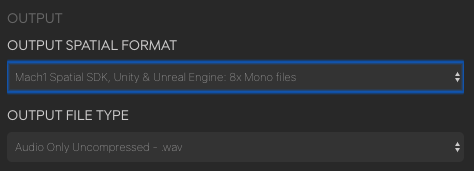

# Spatial Audio Player Example

This is an example of a playlist style spatial audio player to be used for showcasing orientation handling UX for end-users. Further examples will illustrate different methods of playing back the spatial files, allowing and transcoding non Mach1Spatial formats and even supporting streaming input examples for examples of a spatial audio platform app.

### Preparing Spatial AudioFiles
Currently this example is setup to load multi-mono Mach1 Spatial files, we also recommend reducing the size of the app by using a codec such as .aac, instructions for preparing audiofiles for usage in this example as is:

- Use [M1-Transcoder Desktop App](https://www.mach1.tech/spatial-system#transcoder) and input the Mach1Spatial-8 mix into the top field and use the following output modes: 

- This will output 8x mono files which can be renamed as needed
- From your preferred commandline tool run the following command from WITHIN the same directory as the 8x mono files
- `for i in *.wav; do ffmpeg -i "$i" -c:a aac -b:a 128k "${i%.*}.aac"; done`
- Copy or move these 8x .aac files to the `Audio/` directory and add them to the `ViewController.swift` appropriately.